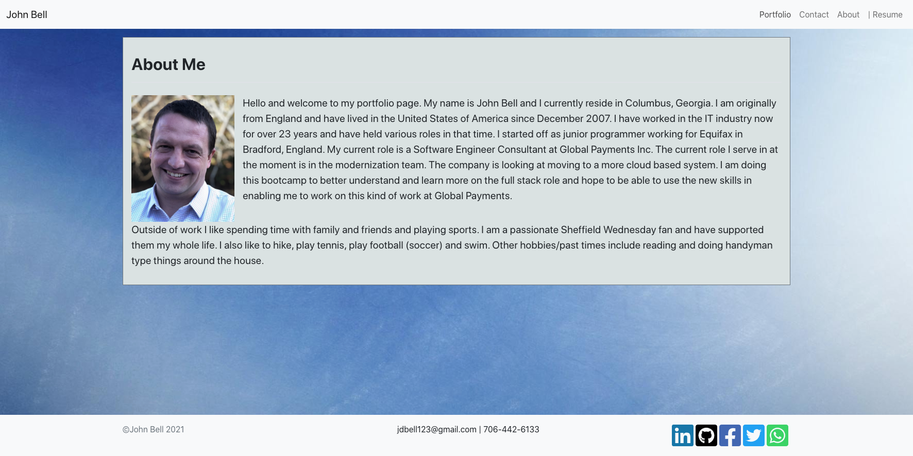
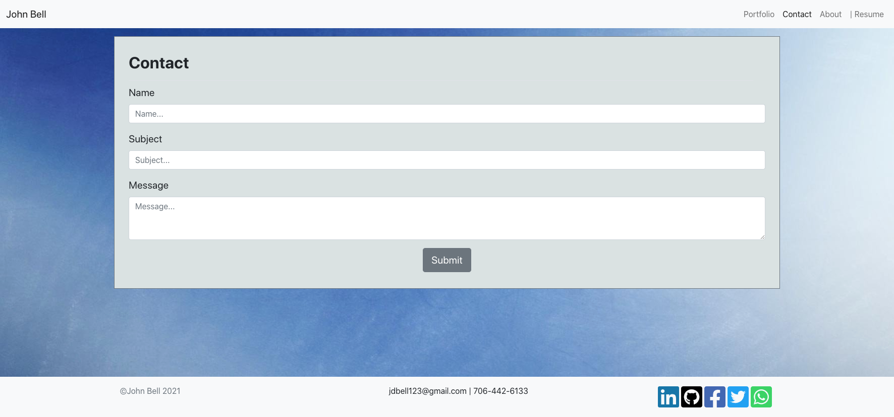
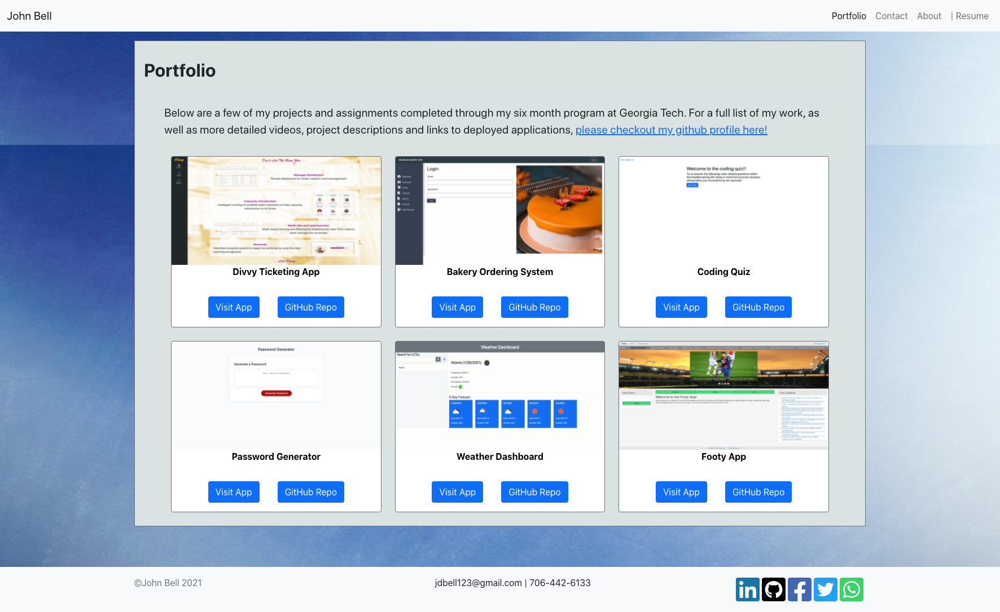

# React Portfolio

 [](https://github.com/jdbell123/react-portfolio/issues)
 [](https://github.com/jdbell123/react-portfolio/stargazers)
## Table of Contents

* [Reason](#reason)
* [Learnt](#learnt)
* [Take-Aways](#Take-Aways)
* [Installation](#installation)
* [Usage](#usage)
* [Credits](#credits)
* [License](#license)
* [Links](#links)

***

## Reason

The reason for this assignment this week was to update our personal portfolio site using React. We were given the following Directions and Requirements:

```
Requirements

* Updated portfolio featuring 6 total projects

* Use React

* A `Header` component that appears on multiple pages

* A single `Project` component that will be used multiple times on a single page 

* Navigation with React Router, dynamic rendering, or another third part router

* A `Footer` component that appears on multiple pages

* Update GitHub profile with pinned repositories featuring those same projects

* Deploy this site to GitHub Pages
```

---

## Learnt

Working on this project I have learnt about the following things:

    1 - How to use React
    2 - How to deploy a React app to GitHub Pages

---

## Take-Aways

React is a fairly new technology, but there is plently of help out there and guidance. I learnt to take your time and not rush things and work on small bits and get that part working and then commit the changes, before moving onto the next thing.

---

## Installation

This project doesn't require any install steps. Just navigate to the URL to see the website.

* [Links](#links)

---

## Usage 

Here are screenshots of the entire website.

About Me Page




Contact Me Page




Portfolio Page




---

## Credits

Big shout out to Google for being my best friend during the week. Also, thanks to all the other students in the bootcamp who have been part of study groups etc. and of course to the teaching staff for helping me out when needed. 

---

## License


Licensed under the [MIT](./LICENSE) license.


---

## Links

[GitHub Repo](https://github.com/jdbell123/react-portfolio)

[Website](https://jdbell123.github.io/react-portfolio/)